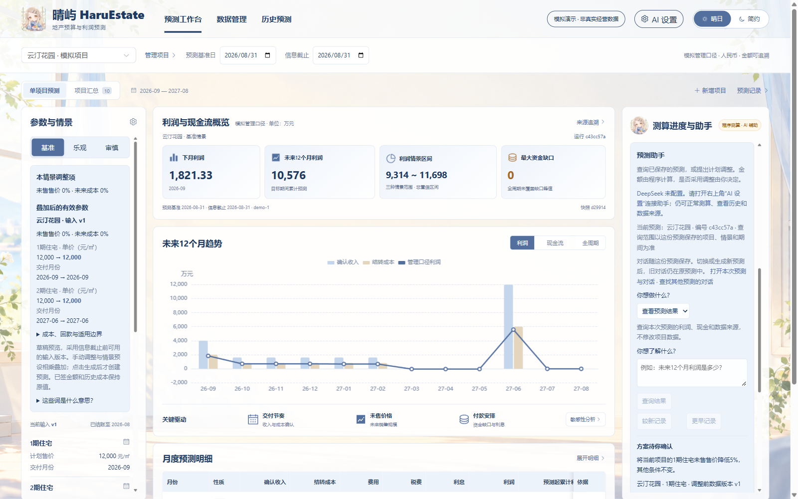
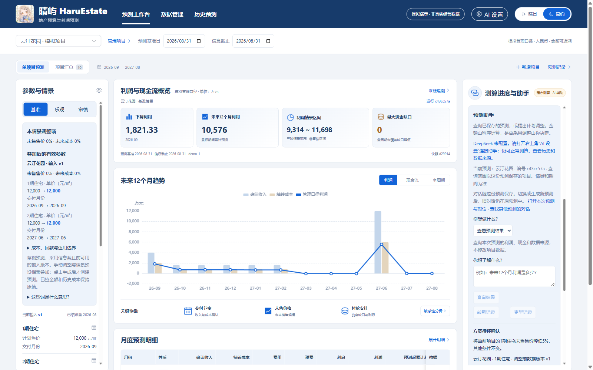

# 晴屿 HaruEstate

用一份可追溯的预测，查看地产项目未来的利润、现金流和资金缺口；通过自然语言查询结果，或提出需要人工确认的调整方案。

**当前阶段：已可本地运行。** 核心测算、数据管理、历史追溯与预测助手已实现，并完成售价调整的真实模型人工验收闭环；目前继续补充验收和体验优化，尚未作为公网生产系统发布。

> 本项目是本机运行的模拟演示。所有经营数据和规则示例均为模拟，不代表企业真实财务数据、政策或预测效果。展示的是模拟管理口径利润，不是法定净利润。

## 界面预览

晴日主题：参数、结果和助手分栏展示，左右栏独立滚动。



简约主题：保持相同项目、预测和操作能力。



## 可以做什么

| 功能 | 用途 |
| --- | --- |
| 单项目预测与项目汇总 | 查看月度利润、现金余额、资金缺口及全周期结果；各项目现金不互相抵销 |
| 情景与敏感性分析 | 比较基准、乐观、审慎条件，以及售价、成本、交付变化的影响 |
| 数据管理与导入 | 维护分期、合同、成本、实际记录和假设，预览 CSV 后确认导入 |
| 来源与历史 | 从金额打开计算依据，查看输入版本、历史预测及同月利润差异 |
| 预测助手：查看预测结果 | 查询当前预测，信息不明确时先追问；不修改业务数据 |
| 预测助手：提出调整方案 | 提议单分期未售售价比例或交付延期，核对后由人确认保存新版本 |

采用方案只保存新数据版本，需要另行生成新预测。确认绑定项目、分期、基础版本及具体方案；数据已经更新时，旧方案不能继续确认。原预测和对话仍保存在原运行中，可从“历史预测”找回。

## 快速启动

需要 Docker 和 Docker Compose，在仓库根目录运行：

```sh
docker compose up --build -d
```

打开 **http://127.0.0.1:8080**。如果端口被占用，可在 PowerShell 中指定其他端口：

```powershell
$env:HARU_PORT='8088'
docker compose up --build -d
```

此时打开 **http://127.0.0.1:8088**。数据库保存在命名卷中，正常重启不会清空记录；请勿使用 `docker compose down -v` 删除数据卷。

1. 选择模拟项目，核对预测基准日、信息截止日及输入版本。
2. 选择情景，点击“生成情景预测”。测算本身不需要模型密钥。
3. 点击金额来源或进入历史预测，查看计算依据与保存版本。
4. 如需预测助手，从顶栏 **AI 设置**输入 DeepSeek 密钥和账户可用的模型名称，配置并测试连接。
5. 选择“查看预测结果”或“提出调整方案”。例如“未来12个月利润是多少？”、“1期住宅未售售价降低5%”。

创建时间和历史步骤显示北京时间；预测基准、信息截止是业务日期，与实际创建时刻分开。晚于信息截止才获知的新数据，不会进入旧时点预测。

## 模型与安全边界

- 金额由独立 Python domain 使用 `Decimal` 计算，API 以十进制字符串传输；模型不计算金额、不执行自由代码或 SQL、不直接修改数据库、不批准方案。
- 模型只接收问题、补充对话和必要的项目名称、分期、期间等路由信息，不接收完整财务表或程序计算的金额。请勿在问题中填写密钥或敏感信息。
- 页面提交的密钥只保存在后端进程内存中，不回显，不写入浏览器持久存储、业务库、检查点或项目文件；后端重启后需要重新配置。
- 连接测试会发起一次真实模型请求，可能产生费用。失败保留原配置；不会自动重复请求。每个任务最多三次模型调用，失败也计入预算。
- 这是仅绑定本机地址、没有多人认证授权的演示应用，不应直接暴露到公网。
- 恢复助手待办需要同时保留业务库和 LangGraph 检查点库。启动、开发、配置与备份细节见 [RUNNING.md](RUNNING.md)。

## 验证情况与当前限制

已完成确定性自动化测试、浏览器回归，以及独立数据目录中的双库备份恢复演练。真实 DeepSeek 已完成明确利润查询、期间澄清、来源查看，以及“降价方案 → 用户确认 → 新数据版本 → 新预测 → 旧预测保留”的人工闭环。新预测已用保存的输入重新计算核对；自动化模型桩不作为真实模型能力证明。

真实调用曾出现格式失败和间歇性超时。现已补充安全错误分类与耗时提示，并调整连接等待；后续重试成功，不代表网络问题已经根治，也不代表所有中文表达都能正确理解。每次使用仍应核对项目、期间和调整内容。

目前调整方案确认前只显示参数变化，尚无完整利润、现金影响试算；交付延期已有实现与自动化验证，真实模型人工闭环仍待补齐。通知资料提取、预测与后续实际结果评估、真实 ERP 接入和多人权限不在当前已交付范围。

## 技术与开发

Vue 3、TypeScript、Element Plus、ECharts；Python、FastAPI、SQLAlchemy、SQLite；一个 LangGraph 受控 Agent，通过薄适配器连接 DeepSeek。

开发环境、锁文件安装及测试命令见 [RUNNING.md](RUNNING.md)。浏览器测试会创建模拟数据，请使用独立测试库。

代码采用 [MIT License](LICENSE)。品牌图像不因代码许可而自动获得第三方再授权。
